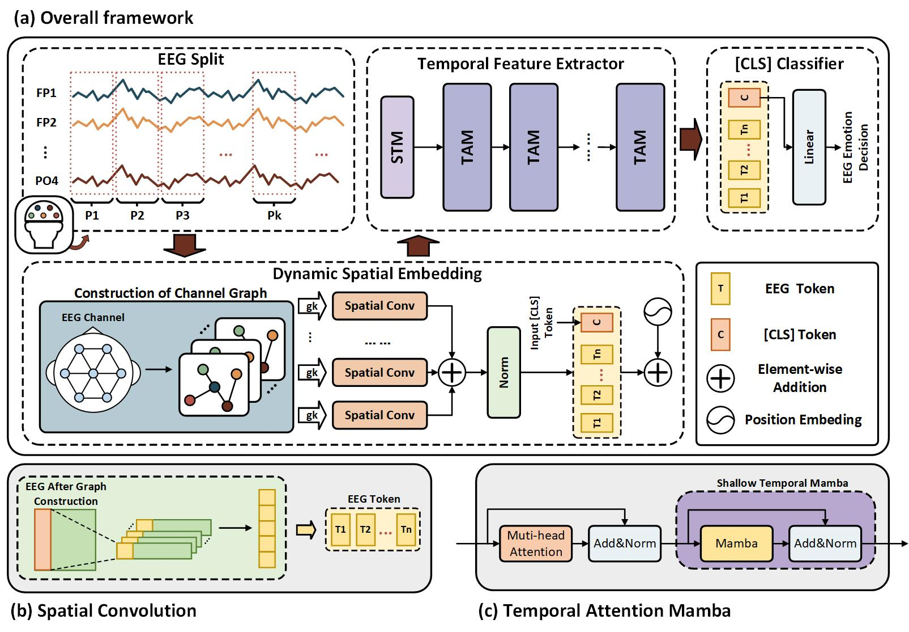

# DSE-TAM: EEG-based Emotion Recognition via Spatiotemporal Dynamic Representations 

## Architecture

## Environment

All models were trained and tested by a single GPU, Nvidia GeForce RTX 3090 ([Driver 530.41.03](https://www.nvidia.com/Download/driverResults.aspx/200481/), [CUDA 12.1](https://developer.nvidia.com/cuda-12-1-0-download-archive)) on [Ubuntu 22.04.2 LTS](https://releases.ubuntu.com/jammy/). The main following packages are required:

- Python 3.10.14
- Pytorch2.1.1 + Pytorch CUDA 11.8
- mamba-ssm 2.2.1
- causal-conv1d 1.4.0