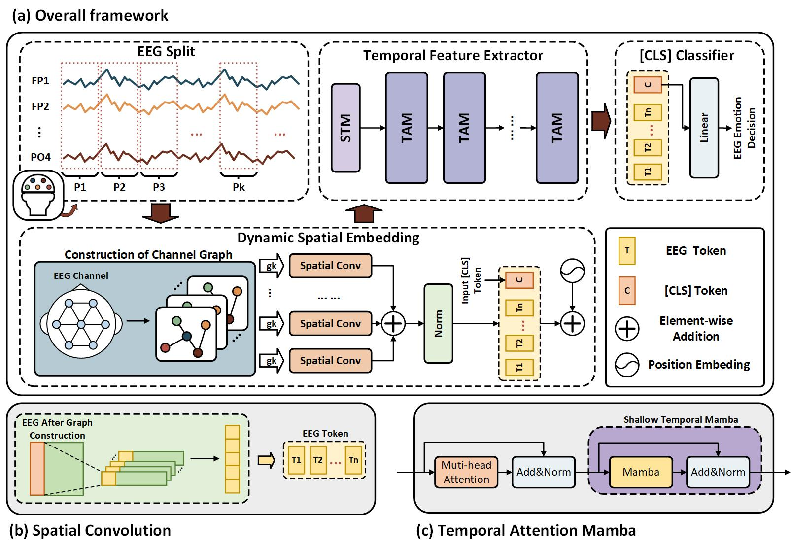

# DSE-TAM: EEG-based Emotion Recognition via Spatiotemporal Dynamic Representations 

## Architecture



## Environment

All models were trained and tested by a single GPU, Nvidia GeForce RTX 3090 ([Driver 530.41.03](https://www.nvidia.com/Download/driverResults.aspx/200481/), [CUDA 12.1](https://developer.nvidia.com/cuda-12-1-0-download-archive)) on [Ubuntu 22.04.2 LTS](https://releases.ubuntu.com/jammy/). The main following packages are required:

- [Python 3.10.14](https://www.python.org/downloads/release/python-31014/)

- [Pytorch 2.1.1](https://pytorch.org/get-started/previous-versions/#v211)

- [CUDA 11.8](https://developer.nvidia.com/cuda-11-8-0-download-archive)

- [mamba-ssm 2.2.1](https://github.com/state-spaces/mamba)

## Models

These models compared with DES-TAM and unitized in the source code are listed below.

- [DGCNN](https://github.com/xujiayang530/DGCNN)
- [ACRNN](https://github.com/yi-ding-cs/LGG)
- [TSception](https://github.com/yi-ding-cs/TSception)
- [Deformer](https://github.com/yi-ding-cs/EEG-Deformer)
- [LGGNet](https://github.com/yi-ding-cs/LGG)
- [Conformer](https://github.com/eeyhsong/EEG-Conformer)

## Datasets

Prepare dataset：

- [DEAP](https://www.eecs.qmul.ac.uk/mmv/datasets/deap/readme.html)
- [DREAMER](https://zenodo.org/records/546113)
- CEED

## Acknowledgement

Some of the source code of is originally from [IJCNN](https://github.com/ynulonger/ijcnn), [PR-PL](https://github.com/KAZABANA/PR-PL). We appreciate the authors for their contribution.

## Citation

If you find our work useful, please consider citing our paper:

``````latex

``````

## Star

If you find our code and dataset useful, we will be appreciate if you can give our repository a ⭐.